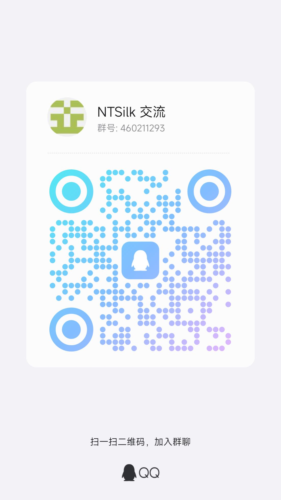

import Link from '@docusaurus/Link'

## NTSilk Bugtracker

如果你遇到了问题，则可以在 [NTSilk Bugtracker](https://github.com/ntsilk/bugtracker)
上提出。

点击下面的按钮即可创建一个新的 Issue。

<Link
  className="button button--secondary button--lg"
  to="https://github.com/ntsilk/bugtracker/issues/new/choose"
>
  创建新 Issue
</Link>

## QQ 群

扫描二维码或点击下面的按钮即可加入 NTSilk 交流群。

<Link
  className="button button--secondary button--lg"
  to="https://qm.qq.com/q/nY5xv0zWTY"
>
  QQ 群：460211293
</Link>
